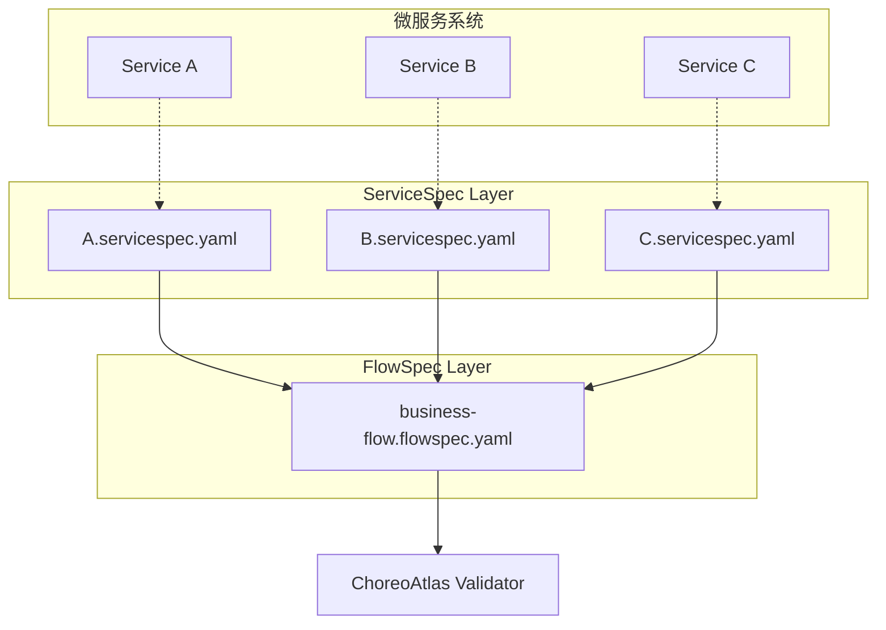

# 双契约架构

ChoreoAtlas 的核心创新是 **ServiceSpec + FlowSpec 双契约架构**，实现了服务级契约与编排级契约的分离治理，为微服务系统提供了完整的"契约即代码"解决方案。

## 🎯 设计理念

传统的微服务治理往往只关注单个服务的API契约，而忽略了服务间编排的治理。ChoreoAtlas 通过双契约架构解决了这个问题：

<div className="architecture-diagram">
  <div style={{textAlign: 'center', margin: '2rem 0'}}>
    <div style={{display: 'inline-block', padding: '1rem', border: '2px solid #2e8b57', borderRadius: '8px', margin: '0 1rem'}}>
      <strong>ServiceSpec</strong><br/>
      <span style={{fontSize: '0.9rem', color: '#666'}}>服务级契约</span>
    </div>
    <span style={{margin: '0 2rem', fontSize: '1.5rem'}}>+</span>
    <div style={{display: 'inline-block', padding: '1rem', border: '2px solid #25c2a0', borderRadius: '8px', margin: '0 1rem'}}>
      <strong>FlowSpec</strong><br/>
      <span style={{fontSize: '0.9rem', color: '#666'}}>编排级契约</span>
    </div>
  </div>
</div>

### 为什么需要双契约？

<div className="row">
  <div className="col col--6">
    <div className="feature-card">
      <h4>🔬 ServiceSpec - 服务级治理</h4>
      <ul>
        <li><strong>接口契约</strong>: API 规范和 Schema 验证</li>
        <li><strong>语义约束</strong>: 前置条件和后置条件（CEL表达式）</li>
        <li><strong>行为规范</strong>: 服务的职责边界</li>
        <li><strong>进化治理</strong>: 接口版本兼容性</li>
      </ul>
    </div>
  </div>
  <div className="col col--6">
    <div className="feature-card">
      <h4>🎭 FlowSpec - 编排级治理</h4>
      <ul>
        <li><strong>时序约束</strong>: 服务调用的先后顺序</li>
        <li><strong>因果关系</strong>: 步骤间的依赖和数据流</li>
        <li><strong>DAG拓扑</strong>: 编排的有向无环图验证</li>
        <li><strong>异常处理</strong>: 错误传播和恢复策略</li>
      </ul>
    </div>
  </div>
</div>

## 📐 架构原理

### 分离关注点（Separation of Concerns）



### 协同验证机制

1. **ServiceSpec 验证**（服务级）
   - 每个服务独立验证其契约遵循情况
   - 使用 CEL 表达式验证前置和后置条件
   - 检查 API Schema 和响应格式

2. **FlowSpec 验证**（编排级） 
   - 验证服务调用的时序关系
   - 检查步骤间的数据依赖和传递
   - 分析编排的 DAG 拓扑结构

3. **交叉验证**（一致性检查）
   - 确保 FlowSpec 引用的服务在 ServiceSpec 中定义
   - 验证数据流的类型兼容性
   - 检查编排覆盖率和完整性

## 🏗️ 实现细节

### ServiceSpec 结构

```yaml title="payment.servicespec.yaml"
apiVersion: servicespec.choreoatlas.io/v1
kind: ServiceSpec
metadata:
  name: payment-service
  version: "1.0.0"

service: "payment"
description: "支付服务契约定义"

operations:
  - operationId: "authorizePayment"
    description: "授权支付请求"
    method: POST
    path: "/paymentAuth"
    
    # 服务级前置条件
    preconditions:
      "valid_amount": "input.amount > 0"
      "valid_currency": "input.currency == 'USD'"
      "valid_card": "has(input.card.number)"
    
    # 服务级后置条件  
    postconditions:
      "authorization_processed": "response.status == 200 || response.status == 402"
      "has_auth_result": "has(response.body.authorised)"
    
    # 示例用例
    examples:
      success:
        request:
          amount: 99.99
          currency: "USD"
          card: {number: "4111111111111111"}
        response:
          status: 200
          body: {authorised: true, authorizationID: "auth123"}
```

### FlowSpec 结构

```yaml title="order-fulfillment.flowspec.yaml"
apiVersion: flowspec.choreoatlas.io/v1
kind: FlowSpec
metadata:
  name: order-fulfillment-flow
  version: "1.0.0"

info:
  title: "订单履行编排流程"
  description: "从下单到发货的完整业务流程"

# 引用 ServiceSpec 契约
services:
  catalogue:
    spec: "./services/catalogue.servicespec.yaml"
  cart:
    spec: "./services/cart.servicespec.yaml"
  payment:
    spec: "./services/payment.servicespec.yaml"
  shipping:
    spec: "./services/shipping.servicespec.yaml"

# 编排级流程定义
flow:
  - step: "商品目录查询"
    call: "catalogue.getCatalogue"
    output:
      products: "response.body"
    timeout: "5s"
    
  - step: "添加到购物车"
    call: "cart.addToCart"
    depends_on: ["商品目录查询"]
    input:
      itemId: "${selectedProduct.id}"
      quantity: "${orderQuantity}"
    output:
      cartTotal: "response.body.total"
    
  - step: "支付授权"
    call: "payment.authorizePayment"
    depends_on: ["添加到购物车"]
    input:
      amount: "${cartTotal}"
      currency: "USD"
    output:
      paymentResult: "response.body"
      authorized: "response.body.authorised"
    retry:
      max_attempts: 3
      backoff: "exponential"
    
  - step: "创建发货单"
    call: "shipping.createShipment" 
    depends_on: ["支付授权"]
    condition: "${authorized} == true"
    input:
      orderTotal: "${cartTotal}"
      paymentAuth: "${paymentResult.authorizationID}"

# 编排级约束
temporal:
  max_duration: "30s"
  step_ordering:
    - ["商品目录查询", "添加到购物车", "支付授权", "创建发货单"]

# 成功标准
success_criteria:
  - all_steps_completed: true
  - payment_authorized: "${authorized} == true"
  - shipment_created: "has(steps['创建发货单'].output.trackingNumber)"
```

## 🔄 验证工作流

### 1. 静态验证（编译时）

```bash
# 验证契约语法和一致性
choreoatlas lint \
  --servicespec services/ \
  --flowspec flows/order-fulfillment.flowspec.yaml
```

检查项目：
- YAML 语法正确性
- Schema 格式验证
- 服务引用的一致性
- CEL 表达式的语法
- 依赖关系的环路检测

### 2. 动态验证（运行时）

```bash  
# 基于追踪数据验证执行
choreoatlas validate \
  --servicespec services/ \
  --flowspec flows/order-fulfillment.flowspec.yaml \
  --trace traces/production-trace.json
```

验证内容：
- ServiceSpec 条件是否满足
- FlowSpec 步骤是否按序执行
- 数据流是否正确传递
- 时序约束是否遵循
- 异常处理是否符合预期

### 3. 交叉验证（一致性检查）

- **引用完整性**: FlowSpec 中的服务调用必须在对应的 ServiceSpec 中定义
- **类型兼容性**: 步骤间传递的数据类型必须兼容
- **覆盖率分析**: 追踪数据必须覆盖契约定义的关键路径

## 🎯 实际应用场景

### 场景1：API 变更影响评估

当 `payment` 服务修改了响应格式：

1. **ServiceSpec 检测**: 新响应不满足现有 postconditions
2. **FlowSpec 检测**: 下游步骤的 input 引用失效
3. **影响分析**: 自动识别受影响的业务流程
4. **修复建议**: 提供契约更新或兼容性保持的建议

### 场景2：新业务流程上线

添加 "会员折扣" 流程：

1. **ServiceSpec 扩展**: 为 `membership` 服务定义新的操作契约
2. **FlowSpec 编排**: 在支付前插入会员验证和折扣计算步骤
3. **依赖分析**: 确保不影响现有的订单流程
4. **测试验证**: 使用新的追踪数据验证完整性

### 场景3：性能问题诊断

当订单处理超时：

1. **ServiceSpec 超时**: 识别哪些服务违反了响应时间契约
2. **FlowSpec 瓶颈**: 分析编排中的关键路径和并发机会
3. **优化建议**: 基于契约分析提供性能优化方案

## 💡 最佳实践

### 1. 契约设计原则

```yaml
# ✅ 好的 ServiceSpec 设计
preconditions:
  "input_validation": "has(input.userId) && input.userId != ''"
  "business_rule": "input.amount > 0 && input.amount < 10000"

postconditions:
  "response_structure": "has(response.body.id)"
  "business_invariant": "response.body.status in ['success', 'failed', 'pending']"

# ❌ 避免的设计
preconditions:
  "too_specific": "input.userId == '12345'"  # 过于具体
  "implementation_detail": "database.connected == true"  # 实现细节
```

### 2. 编排设计原则

```yaml
# ✅ 好的 FlowSpec 设计
flow:
  - step: "验证用户权限"
    call: "auth.validateUser"
    
  - step: "检查库存"
    call: "inventory.checkStock"
    depends_on: ["验证用户权限"]  # 明确依赖关系
    
  - step: "预留库存"
    call: "inventory.reserveStock" 
    depends_on: ["检查库存"]
    condition: "${stockAvailable} == true"  # 条件执行

# ❌ 避免的设计  
flow:
  - step: "做所有事情"
    call: "monolith.processOrder"  # 粒度过粗
```

### 3. 版本演进策略

- **向后兼容**: 新增字段使用可选标记
- **渐进迁移**: 使用版本标签管理契约演进
- **影响分析**: 变更前进行交叉影响分析
- **A/B 验证**: 新旧契约并行验证一段时间

## 🚀 下一步

现在您已经理解了双契约架构的设计理念，继续学习：

- **[快速开始教程](../quickstart)** - 动手实践双契约验证流程
- **[安装指南](../installation)** - 设置 ChoreoAtlas CLI 环境  
- **[GitHub 项目](https://github.com/choreoatlas2025/cli)** - 查看完整的实现和示例

---

<div className="callout info">
  <p><strong>🏛️ 架构哲学</strong></p>
  <p>双契约架构体现了"分离关注点"的软件设计原则：ServiceSpec 关注服务的<strong>能力边界</strong>，FlowSpec 关注业务的<strong>编排逻辑</strong>。两者协同工作，为微服务系统提供了完整且灵活的治理框架。</p>
</div>