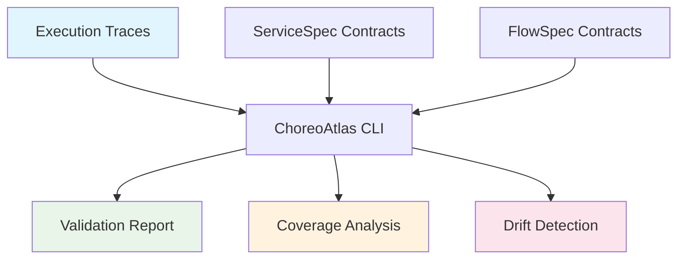

# Introduction

ChoreoAtlas CLI is a powerful "contract-as-code" platform for microservice orchestration governance. It bridges the gap between service design and runtime behavior through executable contracts and real-world validation.

## What is ChoreoAtlas?

ChoreoAtlas implements a **dual contract architecture** that provides both service-level and orchestration-level validation:

- **ServiceSpec Contracts**: Define the "what" - preconditions, postconditions, and semantic rules for individual service operations
- **FlowSpec Contracts**: Define the "how" - step sequences, data flow, and choreography across multiple services

## Key Problems We Solve

### 1. The Documentation-Reality Gap
Traditional API documentation becomes stale quickly. ChoreoAtlas contracts are executable and validated against real traces, ensuring they stay current.

### 2. Microservice Integration Complexity  
As systems grow, understanding the relationships and dependencies between services becomes increasingly difficult. ChoreoAtlas provides a clear, verifiable map of service interactions.

### 3. Runtime Behavior Drift
Services evolve over time, sometimes breaking assumptions that other services depend on. ChoreoAtlas detects these drifts automatically.

### 4. Testing in Production Complexity
Contract validation works with real execution traces from production systems, enabling "testing in production" with confidence.

## How It Works

### The Atlas Component Family

**🔍 Atlas Scout (`discover`)**
- Automatically generates initial contracts from execution traces
- Discovers service relationships and data flows
- Creates baseline contracts for existing systems

**✅ Atlas Proof (`validate`)**  
- Validates FlowSpec choreography against actual execution traces
- Ensures design matches implementation
- Provides detailed coverage and compliance reports

**🧭 Atlas Pilot (`lint`)**
- Static validation of contract consistency
- Detects service reference errors and variable dependencies  
- Provides guidance for contract improvements

## Core Concepts

### Contracts as Executable Specifications

Unlike traditional documentation, ChoreoAtlas contracts are:

- **Executable**: Can be run against real traces for validation
- **Versioned**: Track changes and evolution over time
- **Testable**: Integrate into CI/CD pipelines for continuous validation  
- **Discoverable**: Generate automatically from existing systems

### Trace-Driven Validation

ChoreoAtlas works with real execution data:

- **JSON Traces**: Simple format for custom integrations
- **OTLP Support**: Industry-standard observability data  
- **Production Data**: Validate against real user behavior
- **Privacy-First**: Built-in PII masking and data protection

### Multi-Edition Approach

**Community Edition (CE)**
- Complete dual-contract validation
- Local execution with zero data collection
- Perfect for individual developers and small teams

**Professional Edition (Pro)**  
- Advanced baselines and trend analysis
- Team collaboration and governance features
- Enterprise integrations and notifications

**Cloud Edition**
- Managed service with web console
- Continuous monitoring and drift detection
- Enterprise security and compliance features

## When to Use ChoreoAtlas

### Perfect For:
- **Microservices architectures** with complex service interactions
- **Event-driven systems** requiring choreography validation
- **Teams practicing DevOps** wanting to shift-left on integration testing
- **Organizations** needing compliance and governance over service contracts
- **Modernization projects** documenting existing system behavior

### Also Great For:
- **API-first development** with executable specifications
- **Testing in production** with confidence and safety
- **Onboarding new developers** with clear service interaction maps
- **Regulatory compliance** requiring audit trails of system behavior

## Getting Started

Ready to try ChoreoAtlas? Start with our [Getting Started Guide](./getting-started.md) for a hands-on introduction, or explore the [Quickstart Demo](https://github.com/choreoatlas2025/quickstart-demo) for a complete example.

## Architecture Overview

ChoreoAtlas is built with modern software engineering principles:

- **Go-based CLI** for performance and portability
- **JSON Schema validation** for contract structure  
- **CEL expressions** for semantic validation rules
- **Modular architecture** supporting multiple editions and deployment models
- **Docker-first** deployment with multi-platform support

Continue to [Getting Started](./getting-started.md) to begin your journey with contract-as-code orchestration!