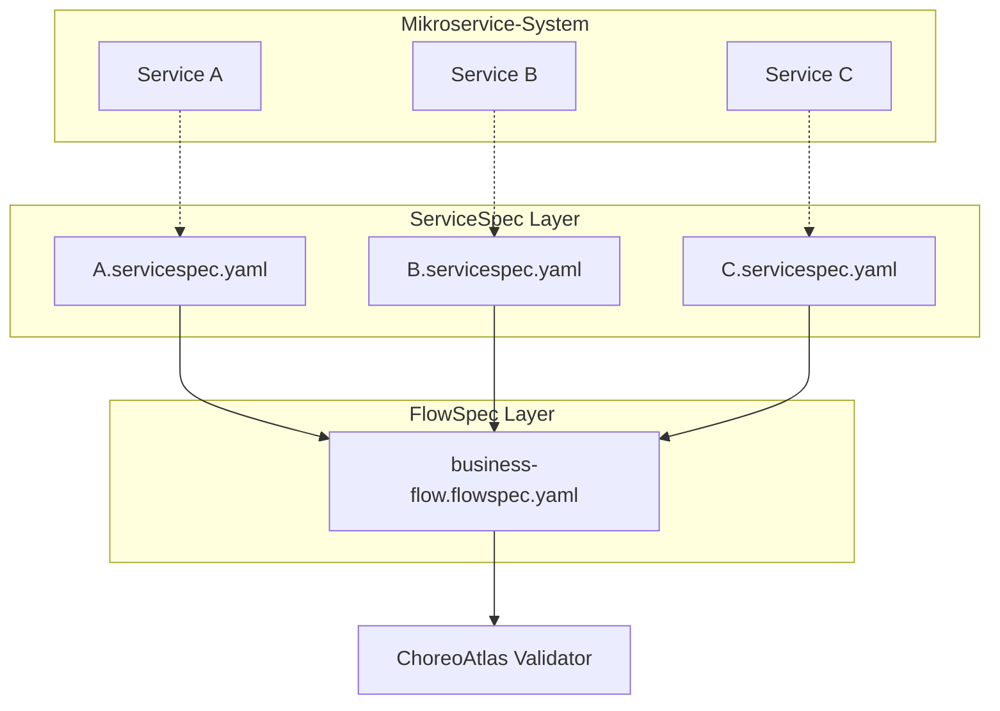

# Duale Vertragsarchitektur

ChoreoAtlas' Kerninnovation ist die **ServiceSpec + FlowSpec duale Vertragsarchitektur**, die eine getrennte Governance von servicebezogenen Verträgen und orchestrierungsbezogenen Verträgen implementiert und eine vollständige "Vertrag-als-Code"-Lösung für Mikroservice-Systeme bereitstellt.

## 🎯 Designphilosophie

Die traditionelle Mikroservice-Governance konzentriert sich oft nur auf die API-Verträge einzelner Services und ignoriert die Governance der Service-übergreifenden Orchestrierung. ChoreoAtlas löst dieses Problem durch die duale Vertragsarchitektur:

<div className="architecture-diagram">
  <div style={{textAlign: 'center', margin: '2rem 0'}}>
    <div style={{display: 'inline-block', padding: '1rem', border: '2px solid #2e8b57', borderRadius: '8px', margin: '0 1rem'}}>
      <strong>ServiceSpec</strong><br/>
      <span style={{fontSize: '0.9rem', color: '#666'}}>Service-Level-Vertrag</span>
    </div>
    <span style={{margin: '0 2rem', fontSize: '1.5rem'}}>+</span>
    <div style={{display: 'inline-block', padding: '1rem', border: '2px solid #25c2a0', borderRadius: '8px', margin: '0 1rem'}}>
      <strong>FlowSpec</strong><br/>
      <span style={{fontSize: '0.9rem', color: '#666'}}>Orchestrierungs-Level-Vertrag</span>
    </div>
  </div>
</div>

### Warum brauchen wir duale Verträge?

<div className="row">
  <div className="col col--6">
    <div className="feature-card">
      <h4>🔬 ServiceSpec - Service-Level-Governance</h4>
      <ul>
        <li><strong>Schnittstellenvertrag</strong>: API-Spezifikationen und Schema-Validierung</li>
        <li><strong>Semantische Einschränkungen</strong>: Vorbedingungen und Nachbedingungen (CEL-Ausdrücke)</li>
        <li><strong>Verhaltensspezifikationen</strong>: Verantwortungsgrenzen des Service</li>
        <li><strong>Evolutionäre Governance</strong>: Schnittstellenversionskompatibilität</li>
      </ul>
    </div>
  </div>
  <div className="col col--6">
    <div className="feature-card">
      <h4>🎭 FlowSpec - Orchestrierungs-Level-Governance</h4>
      <ul>
        <li><strong>Zeitliche Einschränkungen</strong>: Reihenfolge der Service-Aufrufe</li>
        <li><strong>Kausalbeziehungen</strong>: Abhängigkeiten und Datenfluss zwischen Schritten</li>
        <li><strong>DAG-Topologie</strong>: Validierung des gerichteten azyklischen Graphen der Orchestrierung</li>
        <li><strong>Ausnahmebehandlung</strong>: Fehlerausbreitung und Wiederherstellungsstrategien</li>
      </ul>
    </div>
  </div>
</div>

## 📐 Architekturprinzipien

### Trennung der Belange (Separation of Concerns)



### Kooperativer Validierungsmechanismus

1. **ServiceSpec-Validierung** (Service-Level)
   - Jeder Service validiert unabhängig seine Vertragseinhaltung
   - Verwendung von CEL-Ausdrücken zur Validierung von Vor- und Nachbedingungen
   - Überprüfung von API-Schema und Antwortformaten

2. **FlowSpec-Validierung** (Orchestrierungs-Level) 
   - Validierung der zeitlichen Beziehungen von Service-Aufrufen
   - Überprüfung der Datenabhängigkeiten und -übertragung zwischen Schritten
   - Analyse der DAG-Topologiestruktur der Orchestrierung

3. **Kreuzvalidierung** (Konsistenzprüfung)
   - Sicherstellung, dass in FlowSpec referenzierte Services in ServiceSpec definiert sind
   - Validierung der Typkompatibilität des Datenflusses
   - Überprüfung der Orchestrierungsabdeckung und Vollständigkeit

## 🏗️ Implementierungsdetails

### ServiceSpec-Struktur

```yaml title="payment.servicespec.yaml"
apiVersion: servicespec.choreoatlas.io/v1
kind: ServiceSpec
metadata:
  name: payment-service
  version: "1.0.0"

service: "payment"
description: "Definition des Zahlungsservice-Vertrags"

operations:
  - operationId: "authorizePayment"
    description: "Zahlungsanfrage autorisieren"
    method: POST
    path: "/paymentAuth"
    
    # Service-Level-Vorbedingungen
    preconditions:
      "valid_amount": "input.amount > 0"
      "valid_currency": "input.currency == 'USD'"
      "valid_card": "has(input.card.number)"
    
    # Service-Level-Nachbedingungen  
    postconditions:
      "authorization_processed": "response.status == 200 || response.status == 402"
      "has_auth_result": "has(response.body.authorised)"
    
    # Beispiel-Anwendungsfälle
    examples:
      success:
        request:
          amount: 99.99
          currency: "USD"
          card: {number: "4111111111111111"}
        response:
          status: 200
          body: {authorised: true, authorizationID: "auth123"}
```

### FlowSpec-Struktur

```yaml title="order-fulfillment.flowspec.yaml"
apiVersion: flowspec.choreoatlas.io/v1
kind: FlowSpec
metadata:
  name: order-fulfillment-flow
  version: "1.0.0"

info:
  title: "Bestellabwicklungs-Orchestrierungsprozess"
  description: "Vollständiger Geschäftsprozess von Bestellung bis Versand"

# Referenz zu ServiceSpec-Verträgen
services:
  catalogue:
    spec: "./services/catalogue.servicespec.yaml"
  cart:
    spec: "./services/cart.servicespec.yaml"
  payment:
    spec: "./services/payment.servicespec.yaml"
  shipping:
    spec: "./services/shipping.servicespec.yaml"

# Orchestrierungs-Level-Prozessdefinition
flow:
  - step: "Produktkatalog-Abfrage"
    call: "catalogue.getCatalogue"
    output:
      products: "response.body"
    timeout: "5s"
    
  - step: "Zum Warenkorb hinzufügen"
    call: "cart.addToCart"
    depends_on: ["Produktkatalog-Abfrage"]
    input:
      itemId: "${selectedProduct.id}"
      quantity: "${orderQuantity}"
    output:
      cartTotal: "response.body.total"
    
  - step: "Zahlungsautorisierung"
    call: "payment.authorizePayment"
    depends_on: ["Zum Warenkorb hinzufügen"]
    input:
      amount: "${cartTotal}"
      currency: "USD"
    output:
      paymentResult: "response.body"
      authorized: "response.body.authorised"
    retry:
      max_attempts: 3
      backoff: "exponential"
    
  - step: "Versandauftrag erstellen"
    call: "shipping.createShipment" 
    depends_on: ["Zahlungsautorisierung"]
    condition: "${authorized} == true"
    input:
      orderTotal: "${cartTotal}"
      paymentAuth: "${paymentResult.authorizationID}"

# Orchestrierungs-Level-Einschränkungen
temporal:
  max_duration: "30s"
  step_ordering:
    - ["Produktkatalog-Abfrage", "Zum Warenkorb hinzufügen", "Zahlungsautorisierung", "Versandauftrag erstellen"]

# Erfolgskriterien
success_criteria:
  - all_steps_completed: true
  - payment_authorized: "${authorized} == true"
  - shipment_created: "has(steps['Versandauftrag erstellen'].output.trackingNumber)"
```

## 🔄 Validierungs-Workflow

### 1. Statische Validierung (Kompilierzeit)

```bash
# Validierung der Vertragssyntax und Konsistenz
choreoatlas lint \
  --servicespec services/ \
  --flowspec flows/order-fulfillment.flowspec.yaml
```

Prüfpunkte:
- Korrektheit der YAML-Syntax
- Schema-Formatvalidierung
- Konsistenz der Service-Referenzen
- Syntax der CEL-Ausdrücke
- Erkennung von Zyklen in Abhängigkeitsbeziehungen

### 2. Dynamische Validierung (Laufzeit)

```bash  
# Validierung der Ausführung basierend auf Trace-Daten
choreoatlas validate \
  --servicespec services/ \
  --flowspec flows/order-fulfillment.flowspec.yaml \
  --trace traces/production-trace.json
```

Validierungsinhalt:
- Ob ServiceSpec-Bedingungen erfüllt sind
- Ob FlowSpec-Schritte sequenziell ausgeführt werden
- Ob der Datenfluss korrekt übertragen wird
- Ob zeitliche Einschränkungen befolgt werden
- Ob die Ausnahmebehandlung den Erwartungen entspricht

### 3. Kreuzvalidierung (Konsistenzprüfung)

- **Referenzintegrität**: Service-Aufrufe in FlowSpec müssen in entsprechenden ServiceSpec definiert sein
- **Typkompatibilität**: Zwischen Schritten übertragene Datentypen müssen kompatibel sein
- **Abdeckungsanalyse**: Trace-Daten müssen kritische Pfade der Vertragsdefinition abdecken

## 🎯 Praktische Anwendungsszenarien

### Szenario 1: API-Änderungs-Auswirkungsanalyse

Wenn der `payment`-Service das Antwortformat ändert:

1. **ServiceSpec-Erkennung**: Neue Antwort erfüllt bestehende Nachbedingungen nicht
2. **FlowSpec-Erkennung**: Input-Referenzen nachgelagerter Schritte werden ungültig
3. **Auswirkungsanalyse**: Automatische Identifikation betroffener Geschäftsprozesse
4. **Reparaturvorschläge**: Bereitstellung von Empfehlungen für Vertragsupdate oder Kompatibilitätserhaltung

### Szenario 2: Neuer Geschäftsprozess geht online

Hinzufügung des "Mitgliederrabatt"-Prozesses:

1. **ServiceSpec-Erweiterung**: Definition neuer Operationsverträge für `membership`-Service
2. **FlowSpec-Orchestrierung**: Einfügung von Mitgliedervalidierung und Rabattberechnungsschritten vor Zahlung
3. **Abhängigkeitsanalyse**: Sicherstellung, dass bestehende Bestellprozesse nicht beeinträchtigt werden
4. **Testvalidierung**: Verwendung neuer Trace-Daten zur Validierung der Vollständigkeit

### Szenario 3: Leistungsproblem-Diagnose

Bei Bestellbearbeitungs-Timeouts:

1. **ServiceSpec-Timeout**: Identifikation welcher Services Antwortzeitverträge verletzen
2. **FlowSpec-Engpass**: Analyse kritischer Pfade und Parallelisierungsmöglichkeiten in der Orchestrierung
3. **Optimierungsvorschläge**: Bereitstellung von Leistungsoptimierungslösungen basierend auf Vertragsanalyse

## 💡 Best Practices

### 1. Vertragsdesign-Prinzipien

```yaml
# ✅ Gutes ServiceSpec-Design
preconditions:
  "input_validation": "has(input.userId) && input.userId != ''"
  "business_rule": "input.amount > 0 && input.amount < 10000"

postconditions:
  "response_structure": "has(response.body.id)"
  "business_invariant": "response.body.status in ['success', 'failed', 'pending']"

# ❌ Zu vermeidendes Design
preconditions:
  "too_specific": "input.userId == '12345'"  # Zu spezifisch
  "implementation_detail": "database.connected == true"  # Implementierungsdetail
```

### 2. Orchestrierungs-Design-Prinzipien

```yaml
# ✅ Gutes FlowSpec-Design
flow:
  - step: "Benutzerberechtigungen validieren"
    call: "auth.validateUser"
    
  - step: "Lager prüfen"
    call: "inventory.checkStock"
    depends_on: ["Benutzerberechtigungen validieren"]  # Klare Abhängigkeitsbeziehung
    
  - step: "Lager reservieren"
    call: "inventory.reserveStock" 
    depends_on: ["Lager prüfen"]
    condition: "${stockAvailable} == true"  # Bedingte Ausführung

# ❌ Zu vermeidendes Design  
flow:
  - step: "Alles erledigen"
    call: "monolith.processOrder"  # Zu grobe Granularität
```

### 3. Versionsentwicklungsstrategie

- **Rückwärtskompatibilität**: Neue Felder mit optionalen Markierungen verwenden
- **Schrittweise Migration**: Verwendung von Versionstags zur Verwaltung der Vertragsentwicklung
- **Auswirkungsanalyse**: Kreuzauswirkungsanalyse vor Änderungen durchführen
- **A/B-Validierung**: Parallele Validierung alter und neuer Verträge für einen Zeitraum

## 🚀 Nächste Schritte

Nachdem Sie nun die Designphilosophie der dualen Vertragsarchitektur verstanden haben, lernen Sie weiter:

- **[Schnellstart-Tutorial](../quickstart)** - Praktische Erfahrung mit dem dualen Vertragsvalidierungsprozess
- **[Installationsanleitung](../installation)** - Einrichtung der ChoreoAtlas CLI-Umgebung  
- **[GitHub-Projekt](https://github.com/choreoatlas2025/cli)** - Vollständige Implementierung und Beispiele ansehen

---

<div className="callout info">
  <p><strong>🏛️ Architekturphilosophie</strong></p>
  <p>Die duale Vertragsarchitektur verkörpert das Softwaredesign-Prinzip der "Trennung der Belange": ServiceSpec konzentriert sich auf die <strong>Fähigkeitsgrenzen</strong> der Services, FlowSpec auf die <strong>Orchestrierungslogik</strong> des Geschäfts. Beide arbeiten zusammen, um ein vollständiges und flexibles Governance-Framework für Mikroservice-Systeme bereitzustellen.</p>
</div>