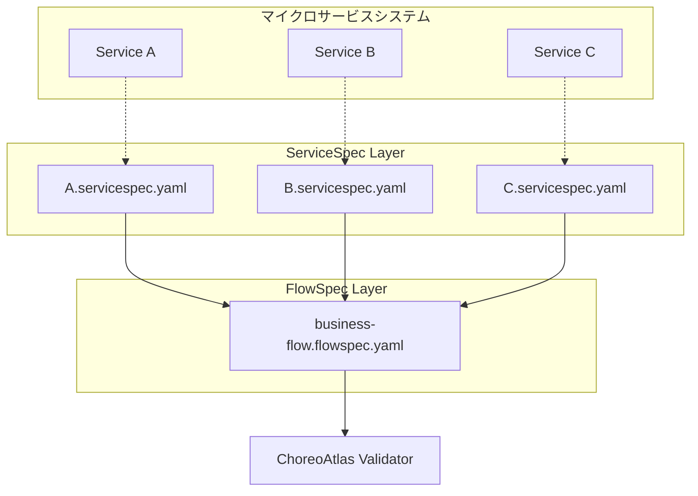

# デュアルコントラクトアーキテクチャ

ChoreoAtlasの核となる革新は**ServiceSpec + FlowSpecデュアルコントラクトアーキテクチャ**であり、サービスレベルコントラクトとオーケストレーションレベルコントラクトの分離ガバナンスを実現し、マイクロサービスシステムに完全な「コントラクトアズコード」ソリューションを提供します。

## 🎯 設計理念

従来のマイクロサービスガバナンスは、個々のサービスのAPIコントラクトにのみ焦点を当て、サービス間のオーケストレーションガバナンスを無視することが多くありました。ChoreoAtlasはデュアルコントラクトアーキテクチャを通じてこの問題を解決しました：

<div className="architecture-diagram">
  <div style={{textAlign: 'center', margin: '2rem 0'}}>
    <div style={{display: 'inline-block', padding: '1rem', border: '2px solid #2e8b57', borderRadius: '8px', margin: '0 1rem'}}>
      <strong>ServiceSpec</strong><br/>
      <span style={{fontSize: '0.9rem', color: '#666'}}>サービスレベルコントラクト</span>
    </div>
    <span style={{margin: '0 2rem', fontSize: '1.5rem'}}>+</span>
    <div style={{display: 'inline-block', padding: '1rem', border: '2px solid #25c2a0', borderRadius: '8px', margin: '0 1rem'}}>
      <strong>FlowSpec</strong><br/>
      <span style={{fontSize: '0.9rem', color: '#666'}}>オーケストレーションレベルコントラクト</span>
    </div>
  </div>
</div>

### なぜデュアルコントラクトが必要なのか？

<div className="row">
  <div className="col col--6">
    <div className="feature-card">
      <h4>🔬 ServiceSpec - サービスレベルガバナンス</h4>
      <ul>
        <li><strong>インターフェースコントラクト</strong>: API仕様とスキーマ検証</li>
        <li><strong>セマンティック制約</strong>: 前提条件と事後条件（CEL式）</li>
        <li><strong>動作規範</strong>: サービスの責任範囲</li>
        <li><strong>進化ガバナンス</strong>: インターフェースバージョン互換性</li>
      </ul>
    </div>
  </div>
  <div className="col col--6">
    <div className="feature-card">
      <h4>🎭 FlowSpec - オーケストレーションレベルガバナンス</h4>
      <ul>
        <li><strong>時系列制約</strong>: サービス呼び出しの順序</li>
        <li><strong>因果関係</strong>: ステップ間の依存関係とデータフロー</li>
        <li><strong>DAGトポロジー</strong>: オーケストレーションの有向非循環グラフ検証</li>
        <li><strong>例外処理</strong>: エラー伝播と回復戦略</li>
      </ul>
    </div>
  </div>
</div>

## 📐 アーキテクチャ原理

### 関心の分離（Separation of Concerns）



### 協調検証メカニズム

1. **ServiceSpec検証**（サービスレベル）
   - 各サービスが独立してそのコントラクトの遵守状況を検証
   - CEL式を使用して前提条件と事後条件を検証
   - APIスキーマとレスポンス形式をチェック

2. **FlowSpec検証**（オーケストレーションレベル） 
   - サービス呼び出しの時系列関係を検証
   - ステップ間のデータ依存関係と転送をチェック
   - オーケストレーションのDAGトポロジー構造を分析

3. **クロス検証**（整合性チェック）
   - FlowSpecで参照されるサービスがServiceSpecで定義されていることを確認
   - データフローの型互換性を検証
   - オーケストレーションカバレッジと完全性をチェック

## 🏗️ 実装詳細

### ServiceSpec構造

```yaml title="payment.servicespec.yaml"
apiVersion: servicespec.choreoatlas.io/v1
kind: ServiceSpec
metadata:
  name: payment-service
  version: "1.0.0"

service: "payment"
description: "決済サービスコントラクト定義"

operations:
  - operationId: "authorizePayment"
    description: "決済認可リクエスト"
    method: POST
    path: "/paymentAuth"
    
    # サービスレベル前提条件
    preconditions:
      "valid_amount": "input.amount > 0"
      "valid_currency": "input.currency == 'USD'"
      "valid_card": "has(input.card.number)"
    
    # サービスレベル事後条件  
    postconditions:
      "authorization_processed": "response.status == 200 || response.status == 402"
      "has_auth_result": "has(response.body.authorised)"
    
    # 使用例
    examples:
      success:
        request:
          amount: 99.99
          currency: "USD"
          card: {number: "4111111111111111"}
        response:
          status: 200
          body: {authorised: true, authorizationID: "auth123"}
```

### FlowSpec構造

```yaml title="order-fulfillment.flowspec.yaml"
apiVersion: flowspec.choreoatlas.io/v1
kind: FlowSpec
metadata:
  name: order-fulfillment-flow
  version: "1.0.0"

info:
  title: "注文履行オーケストレーションフロー"
  description: "注文から発送までの完全なビジネスプロセス"

# ServiceSpecコントラクト参照
services:
  catalogue:
    spec: "./services/catalogue.servicespec.yaml"
  cart:
    spec: "./services/cart.servicespec.yaml"
  payment:
    spec: "./services/payment.servicespec.yaml"
  shipping:
    spec: "./services/shipping.servicespec.yaml"

# オーケストレーションレベルフロー定義
flow:
  - step: "商品カタログ照会"
    call: "catalogue.getCatalogue"
    output:
      products: "response.body"
    timeout: "5s"
    
  - step: "カートに追加"
    call: "cart.addToCart"
    depends_on: ["商品カタログ照会"]
    input:
      itemId: "${selectedProduct.id}"
      quantity: "${orderQuantity}"
    output:
      cartTotal: "response.body.total"
    
  - step: "決済認可"
    call: "payment.authorizePayment"
    depends_on: ["カートに追加"]
    input:
      amount: "${cartTotal}"
      currency: "USD"
    output:
      paymentResult: "response.body"
      authorized: "response.body.authorised"
    retry:
      max_attempts: 3
      backoff: "exponential"
    
  - step: "配送伝票作成"
    call: "shipping.createShipment" 
    depends_on: ["決済認可"]
    condition: "${authorized} == true"
    input:
      orderTotal: "${cartTotal}"
      paymentAuth: "${paymentResult.authorizationID}"

# オーケストレーションレベル制約
temporal:
  max_duration: "30s"
  step_ordering:
    - ["商品カタログ照会", "カートに追加", "決済認可", "配送伝票作成"]

# 成功基準
success_criteria:
  - all_steps_completed: true
  - payment_authorized: "${authorized} == true"
  - shipment_created: "has(steps['配送伝票作成'].output.trackingNumber)"
```

## 🔄 検証ワークフロー

### 1. 静的検証（コンパイル時）

```bash
# コントラクト構文と整合性を検証
choreoatlas lint \
  --servicespec services/ \
  --flowspec flows/order-fulfillment.flowspec.yaml
```

チェック項目：
- YAML構文の正確性
- スキーマ形式検証
- サービス参照の整合性
- CEL式の構文
- 依存関係のループ検出

### 2. 動的検証（実行時）

```bash  
# トレースデータに基づく実行検証
choreoatlas validate \
  --servicespec services/ \
  --flowspec flows/order-fulfillment.flowspec.yaml \
  --trace traces/production-trace.json
```

検証内容：
- ServiceSpec条件が満たされているか
- FlowSpecステップが順序通り実行されているか
- データフローが正しく転送されているか
- 時系列制約が遵守されているか
- 例外処理が期待通りか

### 3. クロス検証（整合性チェック）

- **参照完全性**: FlowSpec内のサービス呼び出しが対応するServiceSpecで定義されている必要がある
- **型互換性**: ステップ間で転送されるデータ型が互換性を持つ必要がある
- **カバレッジ分析**: トレースデータがコントラクト定義の重要パスをカバーする必要がある

## 🎯 実際の応用シナリオ

### シナリオ1：API変更影響評価

`payment`サービスがレスポンス形式を変更した場合：

1. **ServiceSpec検出**: 新しいレスポンスが既存のpostconditionsを満たさない
2. **FlowSpec検出**: 下流ステップのinput参照が無効になる
3. **影響分析**: 影響を受けるビジネスフローを自動識別
4. **修復提案**: コントラクト更新または互換性維持の提案を提供

### シナリオ2：新しいビジネスフローの開始

「会員割引」フローの追加：

1. **ServiceSpec拡張**: `membership`サービスの新しい操作コントラクトを定義
2. **FlowSpecオーケストレーション**: 決済前に会員検証と割引計算ステップを挿入
3. **依存分析**: 既存の注文フローに影響がないことを確認
4. **テスト検証**: 新しいトレースデータを使用して完全性を検証

### シナリオ3：パフォーマンス問題診断

注文処理がタイムアウトした場合：

1. **ServiceSpecタイムアウト**: どのサービスがレスポンス時間コントラクトに違反したかを識別
2. **FlowSpecボトルネック**: オーケストレーション内のクリティカルパスと並行処理機会を分析
3. **最適化提案**: コントラクト分析に基づいてパフォーマンス最適化方案を提供

## 💡 ベストプラクティス

### 1. コントラクト設計原則

```yaml
# ✅ 良いServiceSpec設計
preconditions:
  "input_validation": "has(input.userId) && input.userId != ''"
  "business_rule": "input.amount > 0 && input.amount < 10000"

postconditions:
  "response_structure": "has(response.body.id)"
  "business_invariant": "response.body.status in ['success', 'failed', 'pending']"

# ❌ 避けるべき設計
preconditions:
  "too_specific": "input.userId == '12345'"  # 過度に具体的
  "implementation_detail": "database.connected == true"  # 実装詳細
```

### 2. オーケストレーション設計原則

```yaml
# ✅ 良いFlowSpec設計
flow:
  - step: "ユーザー権限検証"
    call: "auth.validateUser"
    
  - step: "在庫チェック"
    call: "inventory.checkStock"
    depends_on: ["ユーザー権限検証"]  # 明確な依存関係
    
  - step: "在庫予約"
    call: "inventory.reserveStock" 
    depends_on: ["在庫チェック"]
    condition: "${stockAvailable} == true"  # 条件実行

# ❌ 避けるべき設計  
flow:
  - step: "全てを実行"
    call: "monolith.processOrder"  # 粒度が粗すぎる
```

### 3. バージョン進化戦略

- **後方互換性**: 新しいフィールドにはオプション マークを使用
- **段階的移行**: バージョンタグを使用してコントラクト進化を管理
- **影響分析**: 変更前にクロス影響分析を実行
- **A/B検証**: 新旧コントラクトを一定期間並行検証

## 🚀 次のステップ

デュアルコントラクトアーキテクチャの設計理念を理解したので、引き続き学習してください：

- **[クイックスタートチュートリアル](../quickstart)** - デュアルコントラクト検証フローを実践
- **[インストールガイド](../installation)** - ChoreoAtlas CLI環境をセットアップ  
- **[GitHubプロジェクト](https://github.com/choreoatlas2025/cli)** - 完全な実装と例を確認

---

<div className="callout info">
  <p><strong>🏛️ アーキテクチャ哲学</strong></p>
  <p>デュアルコントラクトアーキテクチャは「関心の分離」ソフトウェア設計原則を体現しています：ServiceSpecはサービスの<strong>能力境界</strong>に焦点を当て、FlowSpecはビジネスの<strong>オーケストレーションロジック</strong>に焦点を当てます。両者が協調して動作し、マイクロサービスシステムに完全で柔軟なガバナンスフレームワークを提供します。</p>
</div>